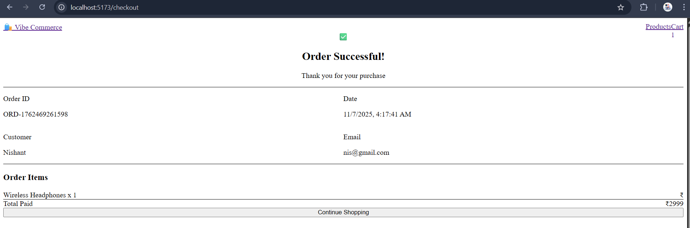
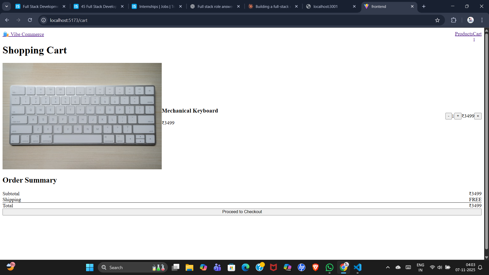
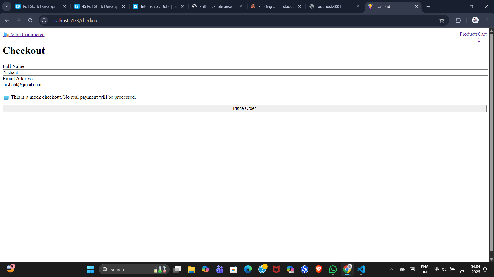
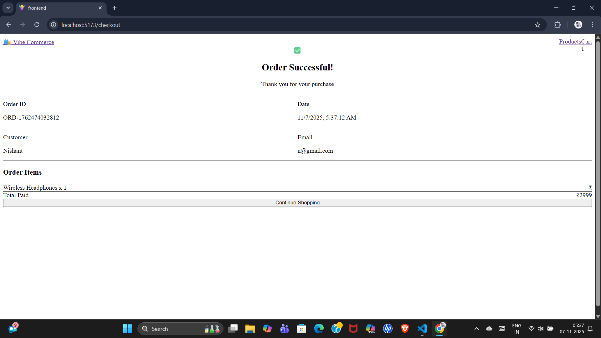

# 🛍️ Vibe Commerce - Full Stack E-Commerce Cart

A complete full-stack shopping cart application built with React, Node.js, Express, and MongoDB for Vibe Commerce screening assignment.

## 🎯 Features

### Backend
- RESTful API with Express.js
- MongoDB database integration
- 7 API endpoints for products, cart, and checkout
- Error handling and validation
- CORS enabled for frontend communication

### Frontend
- Modern React application with React Router
- Beautiful responsive UI with Tailwind CSS
- Product listing with images and descriptions
- Shopping cart with add/remove/update functionality
- Real-time cart count badge
- Mock checkout with order receipt
- Mobile-friendly design

## 🛠️ Tech Stack

**Frontend:**
- React 18
- React Router DOM
- Axios
- Tailwind CSS
- Vite

**Backend:**
- Node.js
- Express.js
- MongoDB with Mongoose
- CORS
- dotenv

## 📁 Project Structure
```
E-ComCart/
├── backend/
│   ├── models/
│   │   ├── Product.js
│   │   └── Cart.js
│   ├── routes/
│   │   ├── products.js
│   │   ├── cart.js
│   │   └── checkout.js
│   ├── server.js
│   ├── .env
│   └── package.json
├── frontend/
│   ├── src/
│   │   ├── pages/
│   │   │   ├── Products.jsx
│   │   │   ├── Cart.jsx
│   │   │   └── Checkout.jsx
│   │   ├── App.jsx
│   │   └── main.jsx
│   ├── index.html
│   └── package.json
└── README.md
```

## 🚀 Setup Instructions

### Prerequisites
- Node.js (v14 or higher)
- MongoDB (local or MongoDB Atlas account)
- Git

### Backend Setup

1. Clone the repository
```bash
git clone <your-repo-url>
cd E-ComCart
```

2. Navigate to backend folder
```bash
cd backend
```

3. Install dependencies
```bash
npm install
```

4. Create `.env` file in backend folder
```env
PORT=3001
MONGODB_URI=mongodb://localhost:27017/vibecommerce
```

5. Start the backend server
```bash
npm run dev
```

Backend will run on `http://localhost:3001`

### Frontend Setup

1. Open new terminal and navigate to frontend folder
```bash
cd frontend
```

2. Install dependencies
```bash
npm install
```

3. Start the development server
```bash
npm run dev
```

Frontend will run on `http://localhost:5173`

## 📡 API Endpoints

| Method | Endpoint | Description |
|--------|----------|-------------|
| GET | `/api/products` | Get all products |
| GET | `/api/products/seed` | Seed mock products |
| GET | `/api/cart` | Get cart items with total |
| POST | `/api/cart` | Add item to cart |
| PUT | `/api/cart/:id` | Update item quantity |
| DELETE | `/api/cart/:id` | Remove item from cart |
| POST | `/api/checkout` | Process checkout and get receipt |

## 💡 Usage

1. **View Products**: Homepage displays all available products
2. **Add to Cart**: Click "Add to Cart" button on any product
3. **View Cart**: Click "Cart" in navigation (shows item count badge)
4. **Update Quantity**: Use +/- buttons in cart
5. **Remove Items**: Click × button to remove items
6. **Checkout**: Click "Proceed to Checkout" button
7. **Place Order**: Fill form (name, email) and submit
8. **View Receipt**: See order confirmation with order ID and details

## 📸 Screenshots

### Products Page

*Browse through available products with beautiful card layout*

### Shopping Cart

*Manage cart items with quantity controls and order summary*

### Checkout

*Simple checkout form for customer details*

### Order Success

*Order confirmation with receipt details*

## 🎨 Design Features

- Clean and modern UI
- Responsive design (mobile, tablet, desktop)
- Smooth transitions and hover effects
- Real-time cart updates
- Visual feedback for user actions
- Professional color scheme

## ✅ Assignment Requirements Met

- ✅ Backend APIs (GET products, POST cart, DELETE cart, GET cart, POST checkout)
- ✅ Frontend with React
- ✅ Product grid with "Add to Cart"
- ✅ Cart view with items/quantity/total
- ✅ Remove/update buttons
- ✅ Checkout form with receipt
- ✅ Responsive design
- ✅ Database persistence (MongoDB)
- ✅ Error handling
- ✅ Clean code structure

## 🔄 Future Enhancements

- User authentication
- Product categories and filtering
- Search functionality
- Product reviews and ratings
- Payment gateway integration
- Order history
- Admin panel

## 📄 License

This project is created for Vibe Commerce screening assignment.

---

**Note:** This is a mock e-commerce application. No real payments are processed.